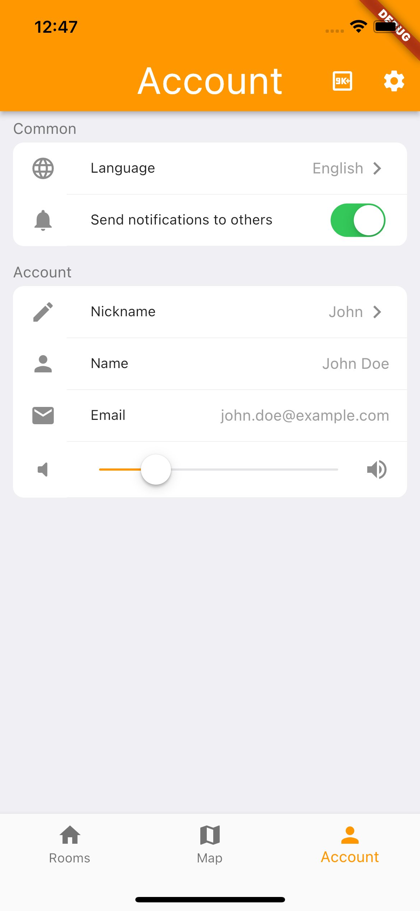
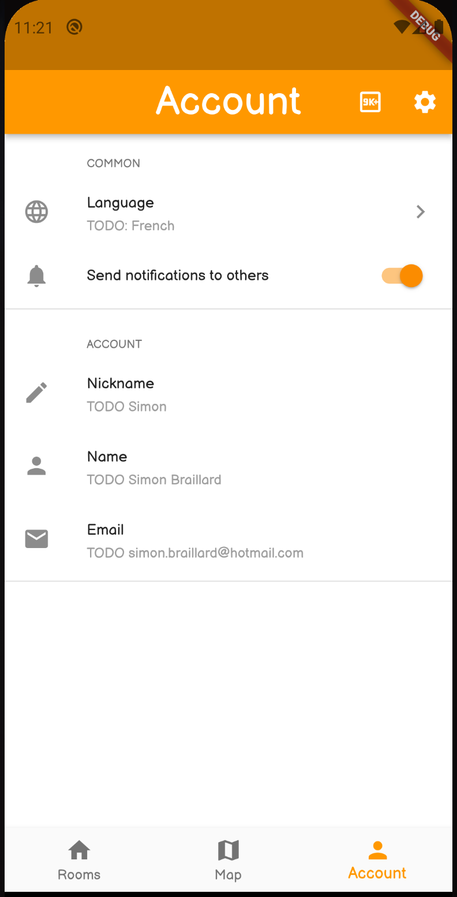

# Platform Settings UI
The perfect package to create easily settings screens.
iOS 15 Settings design and Android 11 Settings design.

## Features

This plugins can make at the moment two types of settings, switch settings and "classic" settings.

 

## Getting started

To start using the package, install it by adding `platform_settings_ui:[version]` to your pubspec.yaml file.
Then, simply import the package to the app.

## Usage

Example in the `/example` folder.

```dart
import 'package:flutter/foundation.dart';
import 'package:flutter/material.dart';
import 'package:platform_settings_ui/platform_settings_ui.dart';
import 'package:platform_settings_ui/settings_tile/settings_switch_tile.dart';

void main() {
  runApp(MyApp());
}

class MyApp extends StatelessWidget {
  @override
  Widget build(BuildContext context) {
    return const MaterialApp(
      debugShowCheckedModeBanner: false,
      title: 'Platform Settings UI Demo',
      home: PlatformUiExample(),
    );
  }
}

class PlatformUiExample extends StatefulWidget {
  const PlatformUiExample({Key? key}) : super(key: key);

  @override
  _PlatformUiExampleState createState() => _PlatformUiExampleState();
}

class _PlatformUiExampleState extends State<PlatformUiExample> {
  @override
  Widget build(BuildContext context) {
    return Scaffold(
      appBar: AppBar(
        title: const Text("Settings"),
      ),
      body: SettingsList(
        children: [
          SettingsSection(
              title: "Common",
              children: [
                SettingsTile(
                  title: "Language",
                  icon: const Icon(Icons.language),
                  onTap: () => print("Tapped"),
                  subTitle: "English",
                ),
                SettingsTile(
                  title: "Theme",
                  icon: const Icon(Icons.add_to_home_screen),
                  onTap: () => print("Tapped"),
                  subTitle: "light",
                )
              ]
          ),
          SettingsSection(
              title: "Account",
              children: [
                SettingsTile(
                  title: "Name",
                  icon: const Icon(Icons.person),
                  onTap: () => print("Tapped"),
                  subTitle: "John Doe",
                ),
                SettingsSwitchTile(
                  title: "Theme",
                  icon: const Icon(Icons.add_to_home_screen),
                  value: true,
                  onChanged: (value) => print(value),
                  activeColor: Colors.red,
                )
              ]
          )
        ],
      ),
    );
  }
}
```

## Additional information

Don't use the widgets with the OS in the name, use the general widget instead and it will automatically use the write os UI.
