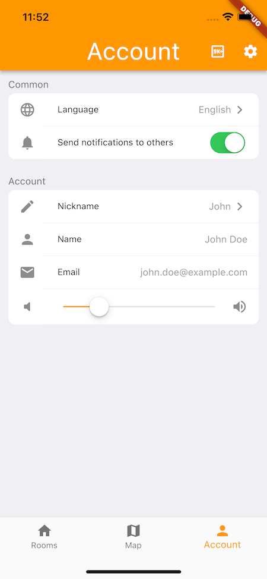
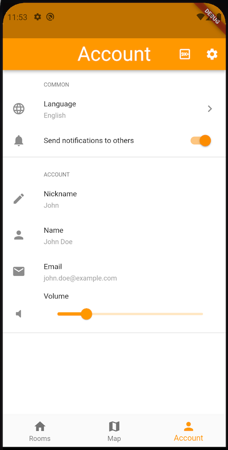
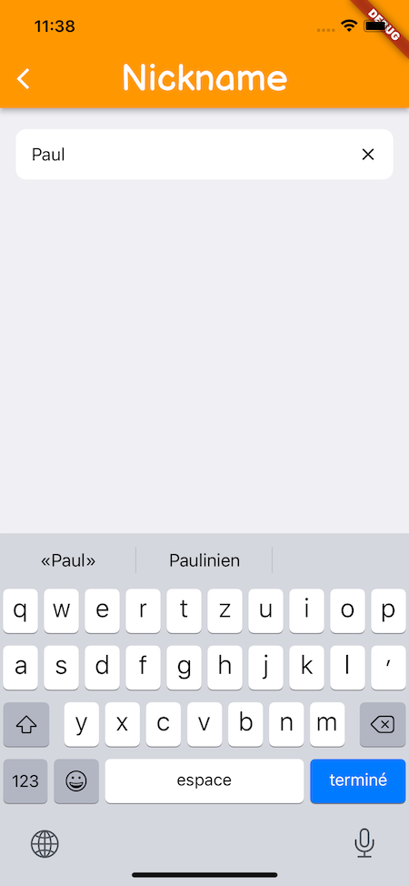
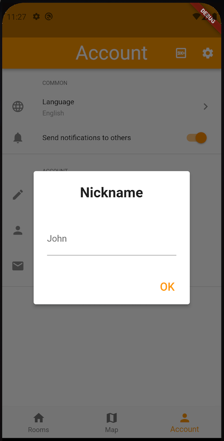
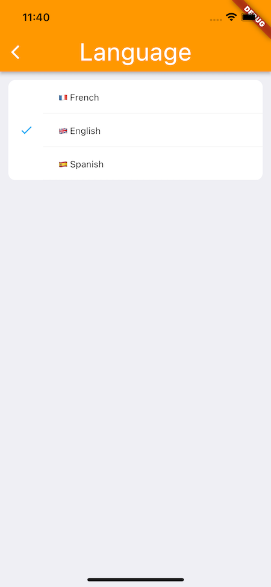
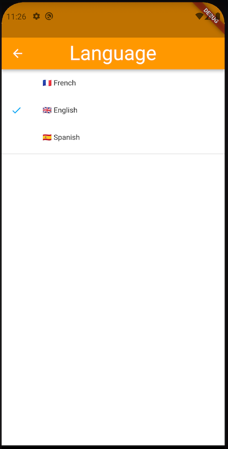

# Platform Settings UI
The perfect package to create easily settings screens.
iOS 15 Settings design and Android 11 Settings design.

## Features

This plugins can make at the moment two types of settings, switch settings, sliders settings and "classic" settings.

With the classic settings, you can chose between `uneditable`, `custom`, `text` and `list`. Those choices allows you to automatically open an "edit" page to edit the settings. See screenshots below to see what it looks like. 

See `\example` or below to see how to implement it. There is a lot a non required options that you can chose between.

type | iOS | Android
--- | --- | ---
Settings: |  | 
Text Edit type: |  | 
List Edit type: |  | 
 

## Getting started

To start using the package, install it by adding `platform_settings_ui:[version]` to your pubspec.yaml file.
Then, simply import the package to the app.

## Usage

Example in the `/example` folder.

```dart
import 'package:flutter/foundation.dart';
import 'package:flutter/material.dart';
import 'package:platform_settings_ui/platform_settings_ui.dart';

void main() {
  runApp(MyApp());
}

class MyApp extends StatelessWidget {
  @override
  Widget build(BuildContext context) {
    return const MaterialApp(
      debugShowCheckedModeBanner: false,
      title: 'Platform Settings UI Demo',
      home: PlatformUiExample(),
    );
  }
}

class PlatformUiExample extends StatefulWidget {
  const PlatformUiExample({Key? key}) : super(key: key);

  @override
  _PlatformUiExampleState createState() => _PlatformUiExampleState();
}

class _PlatformUiExampleState extends State<PlatformUiExample> {
  int groupValue = 1;
  List<String> subTitle = ["French", "English", "Spanish"];
  String name = "John";

  @override
  Widget build(BuildContext context) {
    return Scaffold(
      appBar: AppBar(
        title: const Text("Settings"),
      ),
      body: SettingsList(
          children: [
            SettingsSection(
              title: "Common",
              children: [
                SettingsTile(
                  title: "Language",
                  subTitle: subTitle[groupValue],
                  icon: const Icon(Icons.language),
                  showChevron: true,
                  editType: EditType.list,
                  listEditTypeView: ListEditTypeView(
                    title: "Language",
                    groupValue: groupValue,
                    onChanged: (value) => setState(() {
                      groupValue = value;
                    }),
                    children: [
                      ListEditTile<int>(title: Text("🇫🇷 ${subTitle[0]}"), value: 0),
                      ListEditTile<int>(title: Text("🇬🇧 ${subTitle[1]}"), value: 1),
                      ListEditTile<int>(title: Text("🇪🇸 ${subTitle[2]}"), value: 2),
                    ],
                  ),
                ),
                SettingsSwitchTile(
                  onChanged: (value) => print(value),
                  title: "Send notifications",
                  value: true,
                  icon: const Icon(Icons.notifications),
                )
              ],
            ),
            SettingsSection(
              title: "Account",
              children: [
                SettingsTile(
                  title: "Nickname",
                  subTitle: name,
                  icon: const Icon(Icons.edit),
                  onChanged: (value) => setState(() => name = value),
                ),
                SettingsTile(
                  title: "Name",
                  subTitle: "John Doe",
                  icon: const Icon(Icons.person),
                  showChevron: false,
                  editType: EditType.uneditable,
                ),
                SettingsTile(
                  title: "Email",
                  subTitle: "john.doe@example.com",
                  icon: const Icon(Icons.email),
                  showChevron: false,
                  editType: EditType.uneditable,
                ),
                SettingsSliderTile(
                  onChanged: (value) => print(value),
                  value: 0.2,
                  leadingIcon: Icon(Icons.volume_mute_rounded),
                  trailingIcon: Icon(Icons.volume_up),
                  title: "Volume",
                  titleAndroidOnly: true,
                  trailingIconIosOnly: true,
                ),
              ],
            ),
          ]
      ),
    );
  }
}
```

## Additional information

Don't use the widgets with the OS in the name, use the general widget instead and it will automatically use the write os UI.

You can report issues on the [github](https://github.com/nefus8/platform_settings_ui.git) page or change the way it's implemented by merge requests. 
